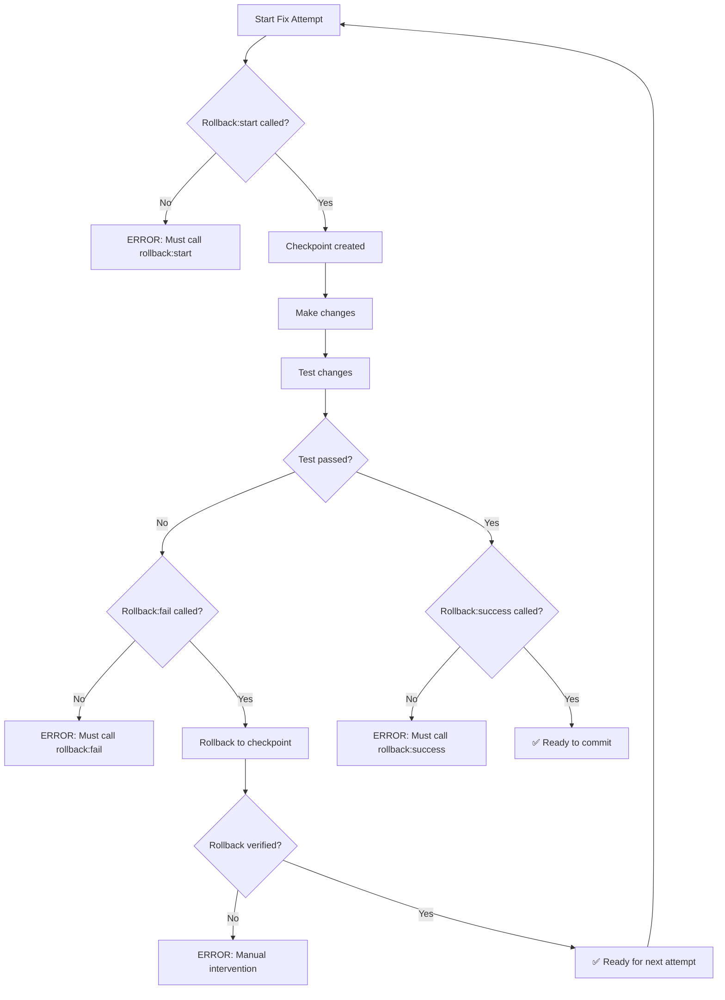

# Reference Document

> **Reference only — not required for agent execution**
>
> This document is preserved for detailed reference and troubleshooting.
> For core rules, see `documentation/core/`.

---

# ROLLBACK PROTOCOL - Failed Fix Recovery System

**Research & Design Document**
**Last Updated:** 2026-01-21
**Status:** Proposed - Pending Implementation

---

## TABLE OF CONTENTS

1. [Problem Statement](#1-problem-statement)
2. [Root Cause Analysis](#2-root-cause-analysis)
3. [Best Practices Research](#3-best-practices-research)
4. [Proposed Solution Design](#4-proposed-solution-design)
5. [Implementation Plan](#5-implementation-plan)
6. [Integration with Existing Systems](#6-integration-with-existing-systems)
7. [Rollback Protocol Specification](#7-rollback-protocol-specification)

---

## 1. PROBLEM STATEMENT

### The "Partial Fix Pollution" Bug

**Scenario:**
```
ATTEMPT 1: Agent suspects image optimizer is causing issue
  1. Disable image optimizer
  2. Test - issue persists
  3. ❌ FORGOTS TO REVERT
  4. Moves to next attempt with broken code still in place

ATTEMPT 2: Agent suspects PWA manifest is causing issue
  1. Modify PWA manifest
  2. Test - issue persists
  3. ❌ FORGOTS TO REVERT
  4. Now has TWO broken changes accumulated

ATTEMPT 3: Agent suspects build config is causing issue
  1. Modify next.config.js
  2. Test - issue persists
  3. ❌ FORGOTS TO REVERT
  4. Now has THREE broken changes

ATTEMPT 4: Agent finally finds fix
  1. Makes working change
  2. Test - issue resolved
  3. Commits ALL changes (including broken ones from attempts 1-3)
  4. ❌ CODEBASE NOW CONTAINS DEAD BROKEN CODE
```

**Impact:**
- Accumulated dead/broken code from failed attempts
- Impossible to determine which change actually fixed the issue
- Future debugging becomes nearly impossible
- Violates clean code principles
- Creates technical debt

### Why This Happens

1. **No Automatic Checkpointing** - Agents don't create save points before changes
2. **No Mandatory Rollback** - Nothing forces cleanup after failed attempts
3. **Poor Session Tracking** - No awareness of which changes belong to which attempt
4. **Manual Reversion is Error-Prone** - Easy to forget, easy to skip
5. **No Verification** - Nothing confirms rollback actually happened

---

## 2. ROOT CAUSE ANALYSIS

### Current Git Workflow Gaps

| Gap | Current State | Risk |
|-----|--------------|------|
| **Pre-Change Checkpoint** | Manual, inconsistent | High |
| **Attempt Isolation** | Changes accumulate on branch | Critical |
| **Post-Failure Rollback** | Manual, forgettable | Critical |
| **Rollback Verification** | None | High |
| **Session Metadata** | Not tracked | Medium |
| **Atomic Change Batches** | Not enforced | High |

### Human/AI Behavior Patterns

1. **Optimism Bias** - Assume current attempt will work, don't prepare for failure
2. **Sunk Cost Fallacy** - Reluctant to discard "work" even if it didn't help
3. **Cognitive Load** - Remembering to rollback adds mental overhead
4. **No Negative Feedback** - System doesn't punish missing rollbacks
5. **Focus Shift** - Once moving to next attempt, previous is "out of sight, out of mind"

---

## 3. BEST PRACTICES RESEARCH

### 3.1 Git-Based Rollback Strategies

#### Strategy A: Stash-Based Attempt Isolation
```bash
# Before each attempt
git save-attempt "attempt-1-description"

# Make changes
# Test

# If failed
git restore-attempt  # Auto-rollback to saved state
```

**Pros:** Simple, uses native git, reversible
**Cons:** Stash is fragile, can conflict easily

#### Strategy B: Temporary Branch Per Attempt
```bash
# Before each attempt
git checkout -b attempt-01-fix-image-optimizer

# Make changes
# Test

# If failed
git checkout main  # Auto-abandon branch
git branch -D attempt-01-fix-image-optimizer
```

**Pros:** Complete isolation, clean history, easy to inspect
**Cons:** Branch proliferation, requires cleanup

#### Strategy C: Commit-Revert Pattern
```bash
# Before each attempt
git commit -am "checkpoint: before attempt 1"

# Make changes
# Test

# If failed
git reset --hard HEAD  # Revert to checkpoint
```

**Pros:** Fast, reliable, preserves work if needed
**Cons:** Pollutes history if checkpoints aren't squashed

### 3.2 Session-Based Change Tracking

#### Metadata Structure
```json
{
  "sessionId": "fix-session-20250121-001",
  "issue": "filter-dropdown-z-index",
  "attempts": [
    {
      "attemptId": 1,
      "hypothesis": "z-index too low on dropdown",
      "checkpoint": "abc1234",
      "filesChanged": ["components/Dropdown.tsx"],
      "outcome": "failed",
      "rollbackVerified": true
    },
    {
      "attemptId": 2,
      "hypothesis": "position strategy wrong",
      "checkpoint": "abc1234",
      "filesChanged": ["components/Dropdown.tsx", "styles/dropdown.css"],
      "outcome": "success",
      "rollbackVerified": false
    }
  ],
  "startTime": "2025-01-21T10:00:00Z",
  "endTime": "2025-01-21T10:45:00Z"
}
```

### 3.3 Generator-Assistant Patterns (Recent Research)

#### Pattern: Atomic Change Batching
- Each change attempt is wrapped in a transaction
- Changes only apply if attempt succeeds
- Automatic rollback on failure

**Implementation:**
```typescript
async function attemptFix<T>(
  hypothesis: string,
  changes: () => Promise<T>,
  test: () => Promise<boolean>
): Promise<T | null> {
  const checkpoint = createCheckpoint();

  try {
    const result = await changes();
    const passed = await test();

    if (!passed) {
      await rollback(checkpoint);
      return null;
    }

    return result;
  } catch (error) {
    await rollback(checkpoint);
    throw error;
  }
}
```

### 3.4 Multi-Agent System Rollback

#### Shared Session State
- All agents in a session share checkpoint metadata
- Coordinated rollbacks prevent partial state
- Distributed lock prevents concurrent modifications

#### Conflict Resolution
- If two agents modify same file, second agent waits
- Attempt metadata tracks which files are "locked"
- Automatic merge conflict detection

---

## 4. PROPOSED SOLUTION DESIGN

### Architecture Overview

```
┌─────────────────────────────────────────────────────────────┐
│                    ROLLBACK GUARDIAN                         │
│                   (scripts/rollback-guardian.ts)             │
├─────────────────────────────────────────────────────────────┤
│                                                               │
│  ┌──────────────┐    ┌──────────────┐    ┌──────────────┐  │
│  │   CHECKPOINT │───▶│   EXECUTE    │───▶│    VERIFY    │  │
│  │   MANAGER    │    │   MANAGER    │    │   MANAGER    │  │
│  └──────────────┘    └──────────────┘    └──────────────┘  │
│         │                    │                    │          │
│         ▼                    ▼                    ▼          │
│  ┌──────────────┐    ┌──────────────┐    ┌──────────────┐  │
│  │   GIT        │    │   SESSION    │    │   AUDIT      │  │
│  │   OPERATIONS │    │   METADATA   │    │   INTEGRATION│  │
│  └──────────────┘    └──────────────┘    └──────────────┘  │
│                                                               │
└─────────────────────────────────────────────────────────────┘
```

### Core Components

#### 4.1 Checkpoint Manager
- Creates git checkpoint before each attempt
- Stores checkpoint hash in session metadata
- Validates checkpoint exists before proceeding

#### 4.2 Execute Manager
- Wraps change execution in try-catch
- Tracks all modified files during attempt
- Records hypothesis and expected outcome

#### 4.3 Verify Manager
- Confirms rollback completed successfully
- Validates no stray changes remain
- Updates session metadata with outcome

### Data Model

#### Session File (.audit/session.json)
```json
{
  "sessionId": "session-20250121-143052",
  "issue": "filter-dropdown-z-index-bug",
  "branch": "fix/filter-dropdown-z-index",
  "baseCommit": "abc1234",
  "currentAttempt": 3,
  "attempts": [
    {
      "attemptId": 1,
      "hypothesis": "increase z-index to 50",
      "checkpoint": "abc1234",
      "files": ["components/filters/FilterBar.tsx"],
      "timestamp": "2025-01-21T14:30:52Z",
      "outcome": "failed",
      "rollbackVerified": true
    }
  ]
}
```

### Enforcement Mechanisms

#### 1. Pre-Change Gate
```bash
# Agent must call before making changes
bun run rollback:start "hypothesis: increase z-index"

# System:
# - Creates checkpoint
# - Initializes attempt metadata
# - Blocks if previous attempt not rolled back
```

#### 2. Post-Failure Gate
```bash
# Agent must call after failed test
bun run rollback:fail

# System:
# - Performs git reset --hard to checkpoint
# - Verifies clean state
# - Updates attempt metadata
# - Blocks proceeding until verified
```

#### 3. Post-Success Gate
```bash
# Agent calls after successful test
bun run rollback:success

# System:
# - Marks attempt as successful
# - Squashes checkpoints into single commit
# - Closes session
```

---

## 5. IMPLEMENTATION PLAN

### Phase 1: Core Infrastructure (Week 1)

#### 5.1.1 Rollback Guardian Script
**File:** `scripts/rollback-guardian.ts`

```typescript
#!/usr/bin/env bun
/**
 * ROLLBACK GUARDIAN - Failed Fix Recovery System
 *
 * Enforces the "Revert on Failure" protocol:
 * 1. Checkpoint before each attempt
 * 2. Mandatory rollback on failure
 * 3. Verification that rollback occurred
 */

import { execSync } from "node:child_process";
import { existsSync, readFileSync, writeFileSync } from "node:fs";

interface SessionMetadata {
  sessionId: string;
  issue: string;
  branch: string;
  baseCommit: string;
  currentAttempt: number;
  attempts: AttemptMetadata[];
}

interface AttemptMetadata {
  attemptId: number;
  hypothesis: string;
  checkpoint: string;
  files: string[];
  timestamp: string;
  outcome?: "pending" | "failed" | "success";
  rollbackVerified?: boolean;
}

const SESSION_FILE = ".audit/session.json";
const CHECKPOINT_PREFIX = "checkpoint-";

// Session management
function createSession(issue: string): SessionMetadata {
  const branch = getCurrentBranch();
  const baseCommit = getCurrentCommit();
  const sessionId = `session-${new Date().toISOString().replace(/[:.]/g, "-")}`;

  return {
    sessionId,
    issue,
    branch,
    baseCommit,
    currentAttempt: 0,
    attempts: [],
  };
}

function loadSession(): SessionMetadata | null {
  if (!existsSync(SESSION_FILE)) return null;
  try {
    return JSON.parse(readFileSync(SESSION_FILE, "utf-8"));
  } catch {
    return null;
  }
}

function saveSession(session: SessionMetadata): void {
  writeFileSync(SESSION_FILE, JSON.stringify(session, null, 2));
}

// Git operations
function getCurrentBranch(): string {
  try {
    return execSync("git rev-parse --abbrev-ref HEAD", { encoding: "utf-8" }).trim();
  } catch {
    return "unknown";
  }
}

function getCurrentCommit(): string {
  try {
    return execSync("git rev-parse HEAD", { encoding: "utf-8" }).trim();
  } catch {
    return "unknown";
  }
}

function createCheckpoint(attemptId: number): string {
  const timestamp = new Date().toISOString();
  const message = `checkpoint: attempt ${attemptId} - ${timestamp}`;

  try {
    // Commit any staged changes as checkpoint
    try {
      execSync("git add -A", { stdio: "pipe" });
    } catch {
      // No changes to stage
    }

    execSync(`git commit -m "${message}" --allow-empty`, { stdio: "pipe" });
    const commit = getCurrentCommit();
    console.log(`✅ Checkpoint created: ${commit}`);
    return commit;
  } catch (error) {
    console.error("❌ Failed to create checkpoint:", error);
    throw error;
  }
}

function rollbackToCheckpoint(checkpoint: string): boolean {
  try {
    execSync(`git reset --hard ${checkpoint}`, { stdio: "pipe" });
    console.log(`✅ Rolled back to checkpoint: ${checkpoint}`);
    return true;
  } catch (error) {
    console.error("❌ Rollback failed:", error);
    return false;
  }
}

function verifyRollback(checkpoint: string): boolean {
  const current = getCurrentCommit();
  const verified = current === checkpoint;
  if (verified) {
    console.log("✅ Rollback verified: working tree clean");
  } else {
    console.error(`❌ Rollback NOT verified: at ${current}, expected ${checkpoint}`);
  }
  return verified;
}

function getModifiedFiles(): string[] {
  try {
    const output = execSync("git status --porcelain", { encoding: "utf-8" });
    return output
      .trim()
      .split("
")
      .filter((line) => line)
      .map((line) => line.substring(3));
  } catch {
    return [];
  }
}

// Commands
function cmdStart(hypothesis: string): void {
  console.log(`
🚀 Starting new fix attempt`);
  console.log(`📋 Hypothesis: ${hypothesis}
`);

  let session = loadSession();

  if (!session) {
    const issue = hypothesis.split(":")[0].trim() || "unknown-issue";
    session = createSession(issue);
    console.log(`📁 Created new session: ${session.sessionId}`);
  }

  // Verify previous attempt was rolled back
  const lastAttempt = session.attempts[session.attempts.length - 1];
  if (lastAttempt && lastAttempt.outcome === "pending") {
    console.error("❌ Previous attempt still pending! Rollback required.");
    console.error("Run: bun run rollback:fail");
    process.exit(1);
  }

  // Create new attempt
  session.currentAttempt++;
  const attemptId = session.currentAttempt;

  // Create checkpoint
  const checkpoint = createCheckpoint(attemptId);

  const attempt: AttemptMetadata = {
    attemptId,
    hypothesis,
    checkpoint,
    files: [],
    timestamp: new Date().toISOString(),
    outcome: "pending",
  };

  session.attempts.push(attempt);
  saveSession(session);

  console.log(`
✅ Attempt ${attemptId} started`);
  console.log(`📍 Checkpoint: ${checkpoint}`);
  console.log(`
⚠️  Make your changes now`);
  console.log(`⚠️  After testing, run: bun run rollback:fail OR bun run rollback:success
`);
}

function cmdFail(): void {
  console.log(`
❌ Attempt failed - initiating rollback
`);

  const session = loadSession();
  if (!session) {
    console.error("❌ No active session found");
    process.exit(1);
  }

  const currentAttempt = session.attempts.find((a) => a.outcome === "pending");
  if (!currentAttempt) {
    console.error("❌ No pending attempt found");
    process.exit(1);
  }

  console.log(`🔄 Rolling back attempt ${currentAttempt.attemptId}`);
  console.log(`📋 Hypothesis was: ${currentAttempt.hypothesis}
`);

  // Perform rollback
  const rollbackSuccess = rollbackToCheckpoint(currentAttempt.checkpoint);

  if (!rollbackSuccess) {
    process.exit(1);
  }

  // Verify rollback
  const verified = verifyRollback(currentAttempt.checkpoint);

  // Update metadata
  currentAttempt.outcome = "failed";
  currentAttempt.rollbackVerified = verified;
  saveSession(session);

  if (verified) {
    console.log(`
✅ Rollback complete and verified`);
    console.log(`📝 Attempt ${currentAttempt.attemptId} marked as failed`);
    console.log(`
💡 Ready for next attempt`);
    console.log(`💡 Run: bun run rollback:start "new hypothesis"
`);
  } else {
    console.error(`
❌ Rollback verification failed`);
    console.error(`⚠️  Manual intervention required`);
    console.error(`⚠️  Run: git reset --hard ${currentAttempt.checkpoint}
`);
    process.exit(1);
  }
}

function cmdSuccess(): void {
  console.log(`
🎉 Attempt successful!
`);

  const session = loadSession();
  if (!session) {
    console.error("❌ No active session found");
    process.exit(1);
  }

  const currentAttempt = session.attempts.find((a) => a.outcome === "pending");
  if (!currentAttempt) {
    console.error("❌ No pending attempt found");
    process.exit(1);
  }

  // Get modified files
  const files = getModifiedFiles();
  currentAttempt.files = files;
  currentAttempt.outcome = "success";
  saveSession(session);

  console.log(`✅ Attempt ${currentAttempt.attemptId} marked as successful`);
  console.log(`📝 Files modified: ${files.length}`);
  console.log(`
📊 Session Summary:`);
  console.log(`   Total attempts: ${session.attempts.length}`);
  console.log(`   Successful attempt: ${currentAttempt.attemptId}`);
  console.log(`   Failed attempts: ${session.attempts.filter((a) => a.outcome === "failed").length}`);
  console.log(`
💡 Ready to commit your changes`);
  console.log(`💡 Run: git commit -m "fix: description"
`);
}

function cmdStatus(): void {
  const session = loadSession();

  if (!session) {
    console.log("📭 No active session
");
    console.log("Start a new session:");
    console.log("  bun run rollback:start \"hypothesis: description\"
");
    return;
  }

  console.log(`
📁 Session: ${session.sessionId}`);
  console.log(`📋 Issue: ${session.issue}`);
  console.log(`🌿 Branch: ${session.branch}`);
  console.log(`
📊 Attempts (${session.attempts.length}):
`);

  for (const attempt of session.attempts) {
    const status = {
      pending: "🟡",
      failed: "❌",
      success: "✅",
    }[attempt.outcome || "pending"];

    console.log(
      `  ${status} Attempt ${attempt.attemptId}: ${attempt.hypothesis}`
    );

    if (attempt.outcome === "failed") {
      console.log(`     Rolled back: ${attempt.rollbackVerified ? "✅" : "❌"}`);
    } else if (attempt.outcome === "success") {
      console.log(`     Files: ${attempt.files.length} modified`);
    }
    console.log();
  }

  const currentAttempt = session.attempts.find((a) => a.outcome === "pending");
  if (currentAttempt) {
    console.log(`⚠️  Attempt ${currentAttempt.attemptId} in progress`);
    console.log(`📍 Checkpoint: ${currentAttempt.checkpoint}`);
    console.log(`
Complete attempt with:`);
    console.log(`  bun run rollback:fail     (if test failed)`);
    console.log(`  bun run rollback:success  (if test passed)
`);
  }
}

// CLI
function main() {
  const args = process.argv.slice(2);
  const command = args[0];
  const param = args[1];

  switch (command) {
    case "start":
      if (!param) {
        console.error("Usage: bun run rollback:start \"hypothesis: description\"");
        process.exit(1);
      }
      cmdStart(param);
      break;

    case "fail":
      cmdFail();
      break;

    case "success":
      cmdSuccess();
      break;

    case "status":
      cmdStatus();
      break;

    default:
      console.log(`
ROLLBACK GUARDIAN - Failed Fix Recovery System

USAGE:
  bun run rollback:start "hypothesis: description"   Start new attempt
  bun run rollback:fail                              Mark attempt as failed (auto-rollback)
  bun run rollback:success                           Mark attempt as successful
  bun run rollback:status                            Show session status

EXAMPLE:
  bun run rollback:start "hypothesis: increase z-index to 50"
  # Make changes...
  bun test
  # If test failed:
  bun run rollback:fail
  # If test passed:
  bun run rollback:success

PROTOCOL:
  1. BEFORE any changes: rollback:start
  2. AFTER testing failed: rollback:fail (MANDATORY)
  3. AFTER testing passed: rollback:success
      `());
  }
}

main();
```

#### 5.1.2 Add NPM Scripts
**File:** `package.json`

```json
{
  "scripts": {
    "rollback:start": "bun scripts/rollback-guardian.ts start",
    "rollback:fail": "bun scripts/rollback-guardian.ts fail",
    "rollback:success": "bun scripts/rollback-guardian.ts success",
    "rollback:status": "bun scripts/rollback-guardian.ts status"
  }
}
```

### Phase 2: Audit Layer Integration (Week 2)

#### 5.2.1 Add Rollback Audit Layer
**File:** `scripts/audit/06.5-rollback.ts`

```typescript
#!/usr/bin/env bun
/**
 * AUDIT LAYER 06.5 - ROLLBACK HYGIENE
 *
 * Checks for:
 * - Uncommitted changes after failed attempts
 * - Orphaned checkpoint commits
 * - Pending rollback operations
 */

import { execSync } from "node:child_process";
import { existsSync, readFileSync } from "node:fs";

interface Violation {
  type: string;
  severity: "critical" | "high" | "medium" | "low";
  file?: string;
  message: string;
  fix?: string;
}

interface AuditResult {
  layer: string;
  status: "pass" | "warn" | "fail";
  violations: Violation[];
  duration: number;
  metadata?: Record<string, unknown>;
}

function checkPendingRollbacks(): Violation[] {
  const violations: Violation[] = [];

  if (!existsSync(".audit/session.json")) {
    return violations;
  }

  try {
    const session = JSON.parse(readFileSync(".audit/session.json", "utf-8"));
    const pendingAttempts = session.attempts?.filter((a: unknown) =>
      typeof a === "object" && a !== null && "outcome" in a && (a as { outcome: string }).outcome === "pending"
    ) || [];

    if (pendingAttempts.length > 0) {
      violations.push({
        type: "PENDING_ROLLBACK",
        severity: "critical",
        message: `${pendingAttempts.length} pending rollback(s) detected`,
        fix: "Run: bun run rollback:fail OR bun run rollback:success to clear",
      });
    }
  } catch {
    // Invalid session file
  }

  return violations;
}

function checkCheckpointCommits(): Violation[] {
  const violations: Violation[] = [];

  try {
    const log = execSync(
      'git log --oneline --grep="^checkpoint:" -n 10',
      { encoding: "utf-8" }
    );

    const checkpointCount = (log.match(/checkpoint:/g) || []).length;

    if (checkpointCount > 3) {
      violations.push({
        type: "EXCESSIVE_CHECKPOINTS",
        severity: "medium",
        message: `${checkpointCount} checkpoint commits found`,
        fix: "Run: bun run rollback:status to manage session",
      });
    }
  } catch {
    // Git error, skip check
  }

  return violations;
}

async function runAudit(): Promise<AuditResult> {
  const startTime = Date.now();
  const violations: Violation[] = [];

  // Run checks
  violations.push(...checkPendingRollbacks());
  violations.push(...checkCheckpointCommits());

  const status = violations.some((v) => v.severity === "critical")
    ? "fail"
    : violations.length > 0
    ? "warn"
    : "pass";

  return {
    layer: "rollback-hygiene",
    status,
    violations,
    duration: Date.now() - startTime,
    metadata: {
      checkedPendingRollbacks: true,
      checkedCheckpointCommits: true,
    },
  };
}

// Run audit and output JSON
const result = await runAudit();
console.log(JSON.stringify(result, null, 2));
```

#### 5.2.2 Update Audit Runner
**File:** `scripts/audit-runner.ts`

Add to `AUDIT_LAYERS` array:
```typescript
{
  id: "06.5",
  name: "rollback-hygiene",
  script: "06.5-rollback.ts",
  description: "Rollback & checkpoint hygiene",
},
```

### Phase 3: Pre-Commit Integration (Week 2)

#### 5.3.1 Update Pre-Commit Hook
**File:** `.husky/pre-commit`

```bash
#!/bin/sh

echo "🔍 Running pre-commit checks..."

# Block token file modifications
TOKEN_CHANGES=$(git diff --cached --name-only --diff-filter=M -- '*.css' | grep -E "styles/tokens" || true)
if [ -n "$TOKEN_CHANGES" ]; then
  echo "❌ Token files are locked. Edit themes.css instead."
  exit 1
fi

# NEW: Check for pending rollbacks
ROLLBACK_STATUS=$(bun run rollback:status 2>&1 || true)
if echo "$ROLLBACK_STATUS" | grep -q "pending"; then
  echo "❌ Pending rollback detected! Complete rollback before committing."
  echo "Run: bun run rollback:fail OR bun run rollback:success"
  exit 1
fi

# Run lint-staged
bun run lint-staged

# Quick audit
STAGED_FILES=$(git diff --cached --name-only | grep -E '\.(ts|tsx|js|jsx)$' | tr '
' ' ')

echo ""
if [ -n "$STAGED_FILES" ]; then
  echo "🔍 Running quick audit on staged files only..."
  AUDIT_FILES="$STAGED_FILES" bun run audit:local
else
  echo "🔍 Running quick audit (Layers 03, 04, 06.5, 07.5)..."
  bun run audit --layer=03 --layer=04 --layer=06.5 --layer=07.5
fi

echo ""
echo "✅ Pre-commit checks passed!"
```

### Phase 4: Documentation (Week 2)

#### 5.4.1 Update Main Documentation
**File:** `/Users/ahmadabdullah/Projects/shadi-V2/CLAUDE.md`

Add after "1. CRITICAL: REVERT ON FAILURE PROTOCOL":

```markdown
## AUTOMATED ROLLBACK SYSTEM

This project includes an automated rollback system to enforce the "Revert on Failure" protocol.

### Quick Start

```bash
# Before making any changes (attempt 1)
bun run rollback:start "hypothesis: increase z-index to 50"

# Make your changes
# ... edit files ...

# Test your changes
bun test

# If test FAILED (MOST COMMON):
bun run rollback:fail     # Auto-rolls back, verified
# Then start next attempt

# If test PASSED:
bun run rollback:success  # Marks attempt successful
# Then commit your changes
```

### The Protocol

1. **START**: Always run `rollback:start` before making changes
2. **FAIL**: Always run `rollback:fail` if test didn't pass
3. **SUCCESS**: Run `rollback:success` only when test passes
4. **CHECK**: Run `rollback:status` to see current session

### What Happens Under the Hood

When you run `rollback:start`:
- Creates git checkpoint commit
- Records your hypothesis
- Verifies no pending rollbacks from previous attempts

When you run `rollback:fail`:
- Resets all files to checkpoint (git reset --hard)
- Verifies rollback actually happened
- Marks attempt as "failed" in session log
- Updates session metadata

When you run `rollback:success`:
- Records which files were modified
- Marks attempt as "successful" in session log
- Ready for commit

### Session Tracking

All sessions are tracked in `.audit/session.json`:

```json
{
  "sessionId": "session-2025-01-21T143052",
  "issue": "filter-dropdown-z-index",
  "attempts": [
    {
      "attemptId": 1,
      "hypothesis": "increase z-index to 50",
      "outcome": "failed",
      "rollbackVerified": true
    },
    {
      "attemptId": 2,
      "hypothesis": "change position strategy",
      "outcome": "success"
    }
  ]
}
```

### Pre-Commit Protection

The pre-commit hook automatically blocks commits if:
- Pending rollback detected (attempt in "pending" state)
- Excessive checkpoint commits (> 3)

You MUST clear the rollback state before committing.

### Integration with Audit System

The rollback system integrates with Layer 06.5 (Rollback Hygiene):

```bash
bun run audit --layer=06.5  # Check rollback hygiene
```

This check runs automatically in pre-commit.
```

---

## 6. INTEGRATION WITH EXISTING SYSTEMS

### 6.1 Audit System Integration

**New Audit Layer:** Layer 06.5 - Rollback Hygiene

| Check | Description | Severity |
|-------|-------------|----------|
| Pending Rollbacks | Detects attempts not marked as fail/success | Critical |
| Excessive Checkpoints | Detects abandoned checkpoint commits | Medium |
| Session File Validity | Validates session.json structure | High |

**Commands:**
```bash
# Check rollback hygiene only
bun run audit --layer=06.5

# Full audit includes rollback check
bun run audit:ci
```

### 6.2 Git Hook Integration

**Pre-Commit Hook Flow:**
```
1. Check for pending rollbacks
   ↓
2. If pending found → BLOCK commit
   ↓
3. Show instructions to clear
   ↓
4. Exit with error
```

**Example Output:**
```
❌ Pending rollback detected! Complete rollback before committing.
📋 Attempt 2: "hypothesis: change z-index"
⚠️  Run: bun run rollback:fail OR bun run rollback:success
```

### 6.3 CI/CD Integration

**GitHub Actions:** Add rollback check to CI workflow

```yaml
- name: Check Rollback Hygiene
  run: bun run audit --layer=06.5
```

---

## 7. ROLLBACK PROTOCOL SPECIFICATION

### 7.1 Agent Workflow (Required)



### 7.2 Error States and Recovery

#### Error: Pending Rollback Detected

**Cause:** Previous attempt started but not resolved

**Recovery:**
```bash
# If test failed:
bun run rollback:fail

# If test passed:
bun run rollback:success

# If you want to abandon entirely:
git reset --hard HEAD~1  # Remove checkpoint
rm .audit/session.json   # Clear session
```

#### Error: Rollback Verification Failed

**Cause:** Git reset didn't work as expected

**Recovery:**
```bash
# Manual rollback
git reset --hard <checkpoint-hash>

# Verify clean state
git status

# Clear session
rm .audit/session.json
```

### 7.3 Best Practices

#### DO:
- Always call `rollback:start` before making changes
- Always call `rollback:fail` if test didn't pass
- Always call `rollback:success` only when test passes
- Check `rollback:status` if unsure
- Review session history before committing

#### DON'T:
- Don't make changes without starting a session
- Don't skip `rollback:fail` after failed tests
- Don't manually commit checkpoints (they'll be squashed)
- Don't edit `.audit/session.json` manually
- Don't proceed to next attempt without resolving current

---

## 8. TESTING PLAN

### 8.1 Unit Tests

```typescript
// test/rollback-guardian.test.ts
describe("Rollback Guardian", () => {
  it("should create checkpoint on start", async () => {
    // Test checkpoint creation
  });

  it("should rollback to checkpoint on fail", async () => {
    // Test rollback
  });

  it("should verify rollback succeeded", async () => {
    // Test verification
  });

  it("should block start if previous attempt pending", async () => {
    // Test enforcement
  });
});
```

### 8.2 Integration Tests

```bash
# Test: Normal successful flow
bun run rollback:start "test hypothesis"
echo "// change" >> test.txt
bun run rollback:success
# Expect: Attempt marked successful, files tracked

# Test: Normal failure flow
bun run rollback:start "test hypothesis 2"
echo "// change" >> test.txt
bun run rollback:fail
# Expect: Files restored, attempt marked failed

# Test: Enforcement - fail without start
bun run rollback:fail
# Expect: Error - no active session
```

### 8.3 Pre-Commit Hook Tests

```bash
# Setup: Start attempt, make changes
bun run rollback:start "test"
echo "change" > test.txt

# Test: Try to commit without resolving
git add test.txt
git commit -m "test"
# Expect: Blocked - pending rollback

# Cleanup
bun run rollback:fail

# Test: Should commit now
git add test.txt
git commit -m "test"
# Expect: Success
```

---

## 9. ROLLBACK DECISION TREE

``                    ┌─────────────────┐
                    │  Ready to fix   │
                    └────────┬────────┘
                             │
                    ┌────────▼────────┐
                    │ rollback:start  │
                    │  "hypothesis"   │
                    └────────┬────────┘
                             │
                ┌────────────▼───────────────┐
                │    Make changes            │
                │    (edit files)            │
                └────────────┬───────────────┘
                             │
                ┌────────────▼───────────────┐
                │    Test changes            │
                │    (bun test)              │
                └────────────┬───────────────┘
                             │
                    ┌────────▼────────┐
                    │  Test PASSED?   │
                    └───────┬─────────┘
                            │
               ┌────────────┴────────────┐
               │                         │
          ┌────▼────┐              ┌────▼────┐
          │   YES   │              │   NO    │
          └────┬────┘              └────┬────┘
               │                        │
          ┌────▼──────────────┐  ┌────▼──────────────┐
          │ rollback:success  │  │  rollback:fail    │
          │ (mark successful) │  │  (auto-rollback)  │
          └────┬──────────────┘  └────┬──────────────┘
               │                        │
          ┌────▼──────────────┐        │
          │  Review changes   │        │
          │  Ready to commit  │        │
          └────┬──────────────┘        │
               │                        │
               │             ┌─────────▼─────────┐
               │             │  Verify rollback  │
               │             │  Clean state?     │
               │             └─────────┬─────────┘
               │                       │
               │             ┌─────────▼─────────┐
               │             │  ✅ Clean state   │
               │             │  Ready for retry  │
               │             └─────────┬─────────┘
               │                       │
               │             ┌─────────▼─────────┐
               │             │  ← Back to start  │
               │             │  (new attempt)    │
               │             └───────────────────┘
               │
          ┌────▼──────────────┐
          │  git commit       │
          │  (clean history)  │
          └────┬──────────────┘
               │
          ┌────▼──────────────┐
          │  ✅ DONE          │
          └───────────────────┘
```

---

## 10. SUMMARY

### Problem Solved

This system eliminates "partial fix pollution" by:

1. **Enforcing checkpoints** - Every attempt starts with a save point
2. **Mandatory rollbacks** - Failed attempts MUST be rolled back
3. **Verification** - System confirms rollback actually happened
4. **Session tracking** - All attempts logged with metadata
5. **Pre-commit protection** - Can't commit with pending rollbacks

### Key Benefits

- Clean git history (only working changes committed)
- Full audit trail of what was tried
- Impossible to accumulate broken code
- Easy to see what hypotheses were tested
- Enforced by hooks, not dependent on memory

### Next Steps

1. Implement Phase 1 (Core Infrastructure)
2. Test with real bug fix scenarios
3. Train agents on new protocol
4. Monitor adoption and compliance
5. Iterate based on feedback

---

**This document is the authoritative specification for the Rollback Protocol system.**
